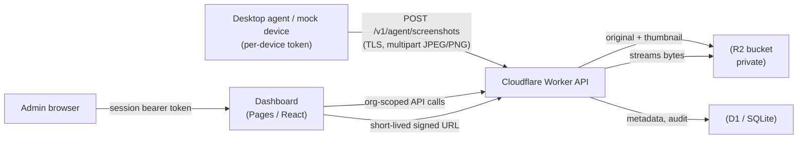

# LinearWatch

A **transparent, disclosed** employee-monitoring service for small businesses. It
captures periodic screenshots from **consenting, notified** users on **company-owned**
devices and lets authorized admins review them in a web dashboard.

> **Disclosed monitoring by design.** The desktop agent shows an always-visible tray
> indicator and a first-run consent notice, and reports consent to the server. There
> are **no** stealth, window-hiding, process-hiding, or anti-detection features, and
> none will be added. Customers must notify and obtain consent from monitored users
> per their local laws; covert or non-consensual use is prohibited (see
> [`legal/`](./legal)).

---

## Status vs. build plan

| Step | Scope | Status |
|---|---|---|
| **1** | D1 schema + Worker API (enroll, ingest, list) with device-token auth | ✅ Done & tested |
| **2** | React + Tailwind dashboard: login, devices, timeline (+ settings, users) | ✅ Done & tested |
| — | Mock device + working **ingest-to-view loop** you can test now | ✅ Done & tested |
| — | Retention cron, audit log, signed URLs, ToS/Privacy templates | ✅ Included |
| **3** | .NET Windows tray agent (consent dialog, capture, upload+retry) | ⏳ Next |
| **4** | Hosted ToS/Privacy pages, deeper settings polish | ◻️ Partial (templates done) |

Steps 1 and 2 are complete, verified end-to-end (mock device → Worker → R2/D1 →
dashboard → full-image view), and ready for you to test before we build the agent.

## Repository layout

```
linearwatch/
├── worker/          Cloudflare Worker API (D1 + R2). The whole backend.
│   ├── src/         index.js (router) + lib/ + routes/
│   ├── schema.sql   D1 schema
│   └── wrangler.toml
├── dashboard/       Cloudflare Pages app — React + Tailwind (Vite)
│   └── src/         pages/ (Login, Devices, DeviceTimeline, Settings, Users)
├── mock-device/     Node CLI that enrolls + uploads synthetic screenshots (no deps)
├── legal/           Terms of Service + Privacy Policy templates
└── agent/           (step 3) .NET tray agent — not built yet
```

## Architecture



**Auth realms:** agents use a **per-device token** (`X-Device-Token`, stored server-side
only as a SHA-256 hash, revocable). Dashboard users use an **email/password session**
(opaque bearer token backed by a `sessions` row). Image viewing uses **HMAC-signed,
short-lived URLs** so an `` tag can load a private R2 object without a header.

---

## Quick start — run the ingest-to-view loop locally

No Cloudflare account needed: `wrangler dev` runs D1 + R2 locally via Miniflare.
Requires Node 18+ (tested on Node 22).

**1. Start the Worker API** (terminal 1):
```bash
cd linearwatch/worker
npm install
cp .dev.vars.example .dev.vars          # dev secrets (gitignored)
npm run schema:local                    # create local D1 tables
npm run dev                             # http://127.0.0.1:8787
```

**2. Provision an org + owner + enrollment code** (terminal 2):
```bash
curl -s -X POST http://127.0.0.1:8787/v1/bootstrap \
  -H "X-Bootstrap-Secret: dev-bootstrap-secret-change-me" \
  -H "Content-Type: application/json" \
  -d '{"org_name":"Acme Co","owner_email":"owner@acme.test","owner_password":"supersecret1","capture_interval_seconds":30}'
# → returns { org, owner, enrollment_code: "LW-XXXX-XXXX-XXXX" }
```

**3. Run the mock device** with that code (terminal 2):
```bash
cd linearwatch/mock-device
node mock-device.mjs --code LW-XXXX-XXXX-XXXX --host MOCK-PC-01 --user jdoe \
  --interval 16 --count 6
# Enrolls, prints the simulated consent dialog, reports consent, uploads 6 frames.
# Keep the client --interval at/above half the org capture interval to avoid throttling.
```

**4. Start the dashboard** (terminal 3):
```bash
cd linearwatch/dashboard
npm install
npm run dev                             # http://127.0.0.1:5173
```

**5. Open the dashboard**, sign in as `owner@acme.test` / `supersecret1`, click
**MOCK-PC-01**, pick today's date, and click a thumbnail to view the full image via a
signed URL. Every full-image view is written to the audit log.

> The mock uploads clearly-labeled synthetic frames (a "simulated capture" banner + a
> 7-segment clock), so nothing is mistaken for a real screen grab.

---

## Worker API reference

| Method | Path | Auth | Purpose |
|---|---|---|---|
| POST | `/v1/bootstrap` | bootstrap secret | Provision org + owner + first code |
| POST | `/v1/auth/login` | — | Email/password → session token |
| POST | `/v1/auth/logout` | session | Revoke current session |
| GET | `/v1/auth/me` | session | Current user + org |
| POST | `/v1/agent/enroll` | enrollment code | Join org → per-device token |
| POST | `/v1/agent/consent` | device token | Report consent acknowledgment |
| GET | `/v1/agent/config` | device token | Interval + monitoring state (heartbeat) |
| POST | `/v1/agent/screenshots` | device token | Upload frame → R2 + thumbnail + D1 |
| GET | `/v1/devices` | session | List org's devices |
| GET | `/v1/devices/:id` | session | One device |
| POST | `/v1/devices/:id/revoke` | admin+ | Revoke device token |
| GET | `/v1/devices/:id/screenshots` | session | Timeline (`?from=&to=&limit=&before=`) w/ signed thumb URLs |
| GET | `/v1/screenshots/:id/full-url` | session | Signed full-image URL (**audited**) |
| GET | `/v1/view` | signed URL | Stream image bytes from R2 |
| GET/PATCH | `/v1/settings` | session / admin+ | Org capture interval + retention |
| POST | `/v1/enrollment-codes` | admin+ | Create enrollment code |
| POST | `/v1/enrollment-codes/:id/revoke` | admin+ | Revoke code |
| GET | `/v1/audit` | admin+ | Recent audit entries |
| GET/POST | `/v1/users` | admin+ | List / create users |
| PATCH/DELETE | `/v1/users/:id` | admin+ | Change role/password / delete |
| POST | `/v1/admin/run-retention` | bootstrap secret | Trigger retention sweep on demand |

## Security & compliance model

- **TLS everywhere**; screenshots are **private** in R2, reachable only via HMAC-signed
  URLs that expire quickly (30 min thumbnails, 5 min full images).
- **Strict tenant isolation** — the org is always taken from the session, never from the
  URL; cross-org reads return 404. (Verified with an isolation test.)
- **Per-device, revocable tokens**, stored only as SHA-256 hashes.
- **Ingestion is validated & rate-limited** — magic-byte type sniff, size cap, a
  minimum gap between frames, and a per-org daily quota.
- **Passwords**: PBKDF2-HMAC-SHA256, 210k iterations, per-user salt (see note below).
- **Retention cron** (hourly) auto-deletes screenshots older than each org's
  `retention_days` and purges expired sessions.
- **Audit log** records logins, screenshot views, settings/user/token changes.
- **RBAC**: owner > admin > viewer; the last owner is protected.

### Schema notes (additions beyond the base spec)

The base schema is implemented as specified, plus two tables the product needs:
`sessions` (revocable dashboard bearer tokens) and `enrollment_codes` (how agents join
an org). A few operational columns were added (`devices.revoked_at`, `paused_reason`;
`screenshots.received_at/bytes/content_type`; `audit_log.detail`).

### Password hashing note

Cloudflare Workers has no native bcrypt/argon2. This uses **PBKDF2-HMAC-SHA256** via the
platform-native WebCrypto (210,000 iterations, per-user salt) — a strong, standards-based
KDF that runs without bundling a slow pure-JS implementation. The stored format is
**versioned** (`pbkdf2$sha256$…`) so we can migrate to argon2id (e.g. via `hash-wasm`)
later with no data reset. Say the word if you'd prefer argon2id now.

---

## Deploying to Cloudflare (when you're ready)

> This repo is public — **no secrets in git**. Secrets are set with `wrangler secret put`
> (production) or `.dev.vars` (local, gitignored).

**Worker:**
```bash
cd linearwatch/worker
npx wrangler d1 create linearwatch          # paste database_id into wrangler.toml
npx wrangler r2 bucket create linearwatch-screenshots
npm run schema:remote
npx wrangler secret put SIGNING_SECRET       # long random string
npx wrangler secret put BOOTSTRAP_SECRET     # provisioning guard
npx wrangler deploy
```

**Dashboard (Cloudflare Pages):** build command `npm run build`, output dir `dist`, root
`linearwatch/dashboard`, env var `VITE_API_BASE=https://<your-worker-url>`. Set the
Worker's `ALLOW_ORIGIN` var to your Pages URL. A `public/_redirects` file already handles
SPA routing.

## Notes

- Dashboard build advisories from `npm audit` are in the Vite/esbuild **dev** toolchain,
  not the shipped static bundle.
- The mock device sends PNG; the real .NET agent (step 3) will JPEG-compress. The Worker
  accepts JPEG/PNG/WebP and generates JPEG thumbnails server-side (Photon/WASM).
